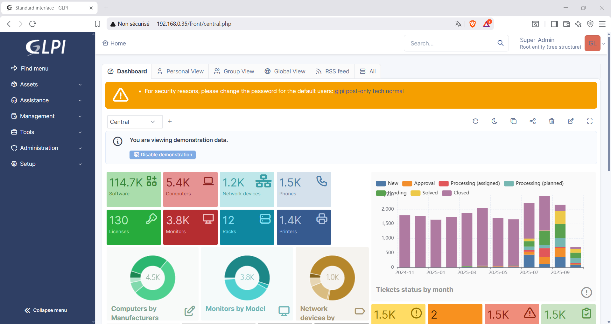
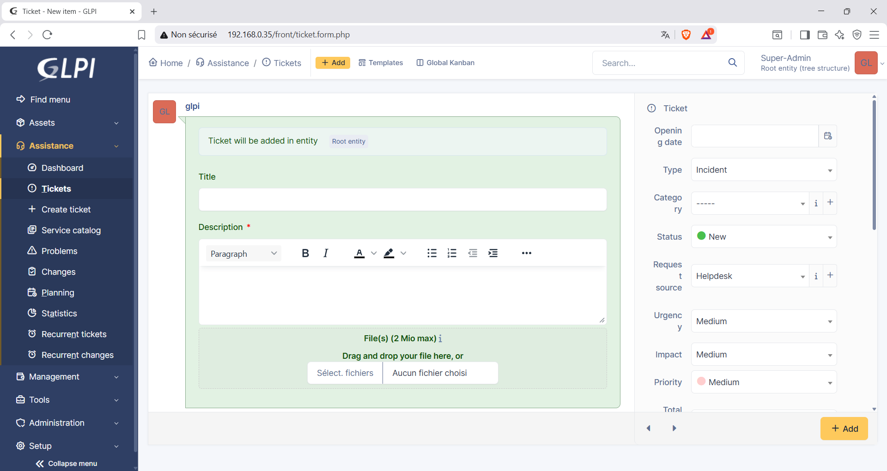

<h1>🚀 Déploiement Automatisé de GLPI 11 sur Ubuntu Server</h1>

<h3>Ce projet propose un script Bash (deploy.sh) permettant d’installer automatiquement GLPI version 11 sur un serveur Ubuntu. Il simplifie toutes les étapes nécessaires à la mise en place d’un environnement fonctionnel pour GLPI, en quelques commandes seulement.</h3>


<p align="center">
  
</p>
<p align="center">
  
</p>


📦 Fonctionnalités du script :
Le script deploy.sh automatise les opérations suivantes :
- 🔄 Mise à jour du système (apt update && apt upgrade)
- 🔐 Installation du serveur OpenSSH
- 🌐 Affichage de l’adresse IP locale
- 🌍 Installation du serveur web Apache2
- 🗄️ Installation du serveur de base de données MariaDB
- 🧩 Installation des extensions PHP nécessaires :
  - php, php-mysql, php-xml, php-mbstring, php-curl, php-gd, php-intl, php-bcmath
- 📥 Téléchargement de l’archive GLPI 11
- ⚙️ Téléchargement des fichiers de configuration :
  - .htaccess
  - glpi.conf
- 🔑 Demande d’un mot de passe pour créer la base de données GLPI
- 🛠️ Création de la base de données et configuration initiale
- ✅ Activation du site GLPI pour y accéder via le navigateur

  
<h3>🧪 Prérequis</h3>

- Ubuntu Server (testé sur 20.04+)
- Accès root ou sudo
- Connexion Internet

<h2>📥 Installation</h2>

```bash
# Télécharger le script
wget https://github.com/GoloG123/GLPIUbuntu/releases/download/deploy/deploy.sh

# Rendre le script exécutable
sudo chmod +x deploy.sh

# Lancer le déploiement
./deploy
```
Suivez les instructions à l’écran pour compléter l’installation.

🌐 Accès à GLPI
Une fois l’installation terminée, ouvrez votre navigateur et accédez à :
```bash
http://[ADDRESSE IP DE LA MACHINE/
```

Voici les logins et mot de passe de base :

LOGIN ET PASSWORD GLPI ADMIN :
```bash
glpi
```
```bash
glpi
```

LOGIN ET PASSWORD USER :
```bash
normal
```
```bash
normal
```

LOGIN ET PASSWORD TECHNICIAN :
```bash
tech
```
```bash
tech
```

LOGIN ET PASSWORD POST-ONLY :
```bash
post-only
```
```bash
post-only
```

<h2>⚠️ Mise en garde ⚠️</h2>

<h3>Important :
Les mots de passe d’accès par défaut de GLPI doivent absolument être modifiés immédiatement après l’installation.
Les identifiants par défaut (comme glpi/glpi, tech/tech, etc.) sont publics et peuvent être utilisés par n’importe qui pour accéder à votre instance.</h3>

<h1>🚧 Ce projet n’est pas destiné à un déploiement en environnement professionnel. 🚧</h1>

<h3>
  Il s’agit uniquement d’un projet de test et de démonstration visant à faciliter l’installation et la découverte de GLPI dans un cadre personnel ou d’apprentissage.
</h3>

Voici le code complet du fichier bash deploy.sh :
```bash
#!/bin/bash
# Script d'initialisation pour le déploiement automatique de GLPI

echo "=== Mise a jour du systeme ==="
sudo apt update -y && sudo apt upgrade -y

echo "=== Installation du serveur SSH ==="
sleep 1
sudo apt install -y openssh-server
clear

echo "=== Verification du service SSH ==="
sleep 1
sudo systemctl enable ssh
sudo systemctl start ssh
sudo systemctl status ssh --no-pager
clear
echo "=========================================="
IP=$(hostname -I | awk '{print $1}')
echo "Adresse ip = $IP"
echo "=========================================="
echo "Noter l'adresse et appuyer sur ENTER…"
echo "=========================================="
read -p ""  
echo "=== Etape 1 terminée avec succès ==="
echo "=== Etape 2 Installation des services web… ==="
echo "=== Installation d'apache… ==="
sleep 1
sudo apt install apache2 -y
clear

echo "=== Installation de MariaDB… ==="
sleep 1
sudo apt install mariadb-server -y
clear

echo "=== Installation de MySQL & PPH… ==="
sleep 1
sudo apt install php php-mysql php-xml php-mbstring php-curl php-ldap php-gd php-intl php-bcmath -y
clear

echo "=== Telechargement de l'archive GLPI... ==="
sleep 1
cd /tmp
wget https://github.com/glpi-project/glpi/releases/download/11.0.1/glpi-11.0.1.tgz
tar -xvzf glpi-11.0.1.tgz
sudo mv glpi /var/www/
sudo chown -R www-data:www-data /var/www/glpi
sudo chmod -R 755 /var/www/glpi
sleep 3
clear

echo "=== Telechargement du fichier .htaccess… ==="
sleep 1
wget https://github.com/GoloG123/GLPIUbuntu/releases/download/deploy/default.htaccess
sudo mv default.htaccess /var/www/glpi/public/.htaccess
sudo chown www-data:www-data /var/www/glpi/public/.htaccess
sudo chmod 644 /var/www/glpi/public/.htaccess
sleep 3
clear 

echo "=== Telechargement du fichier glpi.conf… ==="
sleep 1
wget https://github.com/GoloG123/GLPIUbuntu/releases/download/deploy/glpi.conf
sudo mv glpi.conf /etc/apache2/sites-available/
sleep 3
clear

echo "=== Lancement de la configuration de MySQL… ==="
sleep 1
sudo mysql_secure_installation
clear

echo "==================================================="
read -p "Entrer un mot de passe pour la base de donnée... : " mdp
echo "==================================================="
clear

echo "=== Creation de la base de donnée MariaDB... ==="
sleep 1
sudo mysql -e "CREATE DATABASE glpi CHARACTER SET utf8mb4 COLLATE utf8mb4_unicode_ci;"
sudo mysql -e "CREATE USER 'glpi'@'localhost' IDENTIFIED BY '$mdp';"
sudo mysql -e "GRANT ALL PRIVILEGES ON glpi.* TO 'glpi'@'localhost';"
sudo mysql -e "FLUSH PRIVILEGES;"
sleep 3
clear
 
echo "=== Creation DataBase GLPI… ==="
sleep 1
cd /var/www/glpi
sudo -u www-data php bin/console glpi:database:install --db-host=localhost --db-name=glpi --db-user=glpi --db-password=$mdp
sleep 3
clear 

echo "=== Lancement de Apache pour GLPI... ==="
sleep 1
sudo a2ensite glpi.conf
sudo a2dissite 000-default.conf
sudo a2enmod rewrite
sudo systemctl restart apache2
sleep 3
clear

echo "==== Installation terminée... ========================"
echo 
echo "Connectez vous sur : " $IP
echo
echo "Admin      : Login = glpi      | Password = glpi"
echo "Technicien : Login = tech      | Password = tech"
echo "Post-Only  : Login = post-only | Password = post-only"
echo "User       : Login = normal    | Password = normal"
echo 
echo "======================================================"

```

<h5 align="center">🔧 Projet de test GLPI développé par <strong>Emmanuel Defend</strong> — partage libre pour apprentissage et découverte 🔧</h5>


